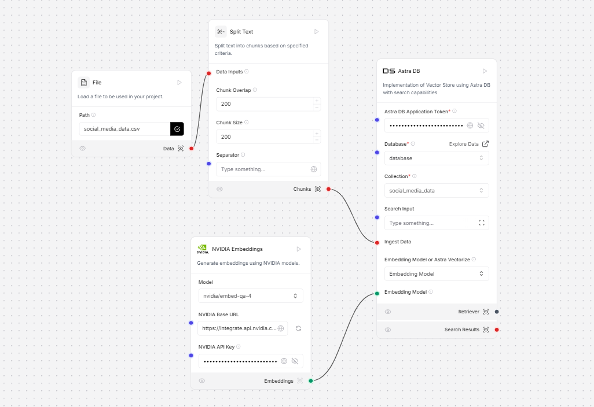
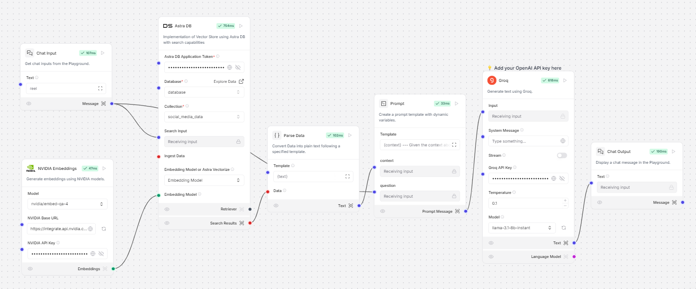

# SocialSights

# Social Media Analytics Platform

## Complete Technical Documentation

## Deployment

### Live Application

- Production URL:
- Platform: Render
- Status: Active

### Deployment Infrastructure

- Frontend: Render Web Services
- Database: DataStax Astra DB
- AI Integration: Langflow & OpenAI

## Project Overview

### Objective

Build an analytics module that analyzes engagement data from mock social media accounts using Langflow and DataStax integration.

### Core Components

- DataStax Astra DB for database operations
- Langflow for workflow creation and GPT integration
- React-based frontend
- Node.js proxy backend
- Groq integration

### Key Features

- Real-time social media analytics
- Groq-powered insights generation
- AI Powered Chat Bot
- Custom metric tracking
- Data visualization
- Post performance analysis
- Engagement metrics calculation

## System Architecture

### Frontend Layer

1. **Landing Page**

   - Header with navigation
   - Features showcase
   - Team information
   - Call-to-action elements

2. **Analytics Dashboard**
   - Performance overview cards
   - Data visualization section
   - Analytics insights panel
   - Data grid for detailed view

### Backend Layer

1. **Proxy Server**

   - WebSocket connections
   - Request handling
   - Response streaming
   - Error management

2. **Data Processing**
   - Text splitting and chunking
   - Data parsing
   - Vector store implementation
   - Groq integration

This documentation provides a comprehensive overview of the Social Media Analytics Platform. For specific implementation details or clarification, please refer to the individual sections or contact the development team.
